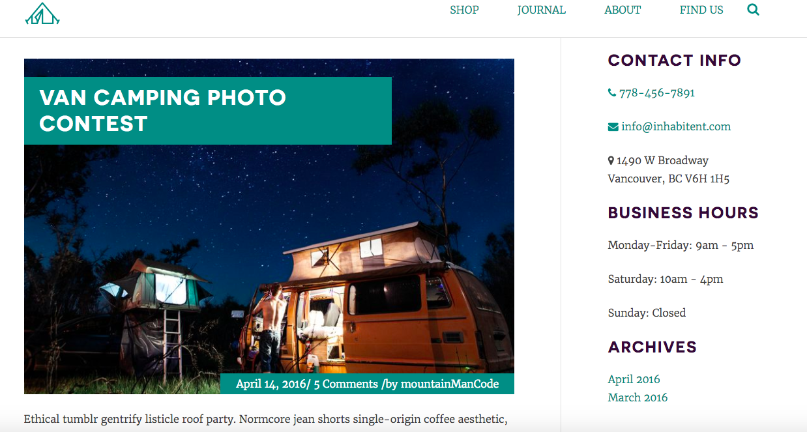

# Inhabitent

A WordPress starter theme for a camping supply store and blog for hipsters, forked from Underscores. 

  
  
  

## Technology Used
* HTML5
* CSS3
* Javascript - jQuery
* PHP

## Built With

* Wordpress
* Visual Studio - Code Editor
* Gulp - task runner
* Git - Github
* Chrome - dev tools

## Installation

### 1. Download me (don't clone me!)

Then add me to your `wp-content` directory.

### 3. Install the dev dependencies

Next you'll need to run `npm install` **inside your theme directory** next to install the node modules you'll need for Gulp, etc.

### 4. Update the proxy in `gulpfile.js`

Lastly, be sure to update your `gulpfile.js` with the appropriate URL for the Browsersync proxy (so change `localhost[:port-here]/[your-dir-name-here]` to the appropriate localhost URL).

## Authors

* **Aaron Griffiths** - (https://github.com/mountainmancode)

## Contributors

* Thank you Rose and Jim of Red Academy for leading the charge on the project.
* Fall 2017 Cohort.

## Observations
* It was a great experience learning how to navigate through pages with chrome dev tools to find where to apply styles. I can definitely say my CSS3 styling skills have doubled during this project.  I also found Wordpress to be an amazing way to manage and develop a website. I feel like I got a good handle on it, but there is still much to learn. 